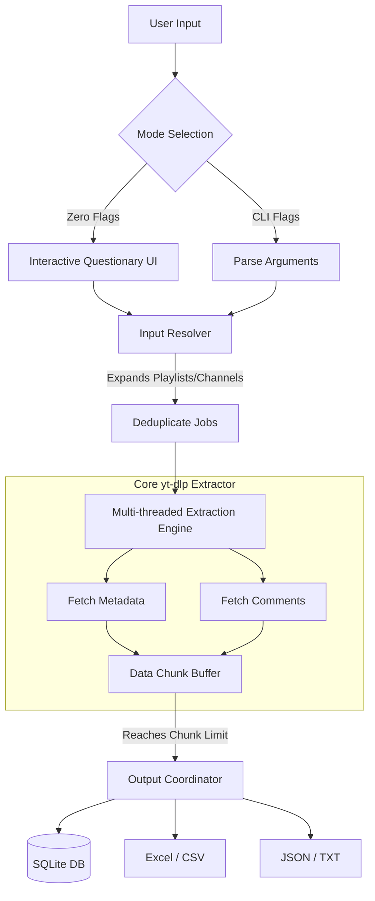

<div align="center">

<!-- You can replace this src with your actual uploaded logo link -->


# ⚡ YT-Analyzer (Exylo Analytica)

**Advanced YouTube Metadata & Community Insights Extraction CLI Engine.**

[](https://python.org)
[](https://github.com/yt-dlp/yt-dlp)
[](https://microsoft.com)
[](#)
[](#12-license--terms-of-use)

</div>

---

## 📖 1. About the Project
**YT-Analyzer** is a high-performance, multi-threaded Command Line Interface (CLI) tool designed for researchers, analysts, and content creators. It seamlessly extracts deep metadata, video statistics, and user comments from YouTube videos, playlists, and entire channels. Built with an emphasis on speed and stability, it features dynamic memory chunking, rate-limit evasion, and a beautiful interactive terminal UI.

Whether you need bulk data for analytics or just quick metadata in a JSON file, YT-Analyzer handles it with a sleek, modern architecture.

---

## ✨ 2. Key Features
* **🚀 Multi-Threaded Engine:** Process massive playlists or bulk URLs concurrently, dramatically reducing extraction time.
* **🎛️ Interactive UI Mode:** Run the tool without flags to trigger a beautiful, keyboard-navigable interactive menu.
* **💾 Versatile Output Formats:** Export your scraped data to `JSON`, `CSV`, `Excel (XLSX)`, `Text`, or directly into a local `SQLite DB`.
* **🛡️ Resilient & Smart:** Built-in rate-limit handling, random delays, and proxy support to ensure uninterrupted scraping.
* **🧠 Memory Efficient:** Processes data in customizable chunks (e.g., 50 videos at a time) to prevent RAM overload during massive operations.
* **⚙️ Seamless Windows Integration:** Comes with a native Windows Installer that automatically configures system PATH for global access.

---

## 🏗️ 3. System Architecture & Flowchart

Below is the high-level operational flow of the YT-Analyzer extraction engine:



---

## 🛠️ 4. Technology Stack

This project leverages modern Python libraries and build tools to ensure top-tier performance:

* **Core Language:** Python 3.10+
* **Extraction Engine:** `yt-dlp` (Core backend for reliable data fetching)
* **Terminal UI:** `rich` (For beautiful banners, tables, and progress bars) & `questionary` (For interactive prompts)
* **Data Processing:** `pandas`, `openpyxl` (For Excel/CSV manipulation)
* **Build & Deployment:** `PyInstaller` (For standalone compilation) & `Inno Setup` (For professional Windows installers)

---

## 📸 5. Screenshots

| Interactive UI Mode | Live Progress & Extraction |
| --- | --- |
|  |   |
| *Select fields, formats, and limits via arrow keys.* | *Real-time multi-threaded progress tracking.* |

*(Note: Replace the placeholder image links with actual screenshots uploaded to your repository's `assets` folder.)*

---

## 💻 6. Setup & Run (From Source Code)

If you are a developer and want to run or modify the Python scripts directly:

**Step 1:** Clone the repository

```bash
git clone https://github.com/mmizan85/YT-Analyzer.git
cd YT-Analyzer
```

**Step 2:** Create a Virtual Environment (Recommended)

```bash
python -m venv venv
source venv/Scripts/activate  # On Windows
```

**Step 3:** Install Dependencies

```bash
pip install -r requirements.txt
```

**Step 4:** Run the tool

```bash
# Launch interactive mode
python -m main.py

# Or use the quick 3-letter alias!
pip install -e .

# Launch interactive mode
yta -h  # or
yt-analyzer -h
```

---

## 📦 7. Download & Install (Windows Installer)

For everyday users, we provide a pre-compiled Windows executable via **Inno Setup**.

1. Go to the [Releases](https://github.com/mmizan85/YT-Analyzer/releases/tag/v1.0.0) page of this repository.
2. Download the latest `YT_Analyzer_Setup.exe`.
3. Double-click the installer and follow the on-screen prompts.
4. The installer automatically adds the tool to your Windows System `PATH`.

**How to Use After Installation:**
Open your Command Prompt (CMD) or PowerShell anywhere on your PC and type either the full name or the short alias:

```bash
# Full command
yt-analyzer -i "https://youtube.com/watch?v=YOUR_VIDEO_ID"

# Or use the quick 3-letter alias!
yta -h
```

---

## 🎛️ 8. Help Commands & Parameters

Here are the primary arguments you can pass to the CLI for automated scraping:

| Flag / Command | Type | Description | Example |
| --- | --- | --- | --- |
| `-i, --input` | `String` | Target URL (Video, Playlist, Channel) or a `.txt` file containing URLs. | `-i "playlist_url"` |
| `-f, --fields` | `String` | Comma-separated fields to extract. | `-f "title,views,likes,comments"` |
| `-fmt, --format` | `String` | Output format(s). Available: `json, csv, xlsx, txt, db`. | `-fmt "xlsx,db"` |
| `--comments-limit` | `Integer` | Max comments to extract per video. (0 = skip comments). | `--comments-limit 50` |
| `--workers` | `Integer` | Number of concurrent extraction threads. Default is 4. | `--workers 8` |
| `--delay` | `String` | Random delay (min,max) in seconds to avoid IP blocks. | `--delay "1,3"` |
| `-o, --output-dir` | `String` | Custom directory to save the exported data. | `-o "./my_data"` |

**Quick Example:**

```bash
yta -i "PLAYLIST_URL" -f "title,views,likes,comments" -fmt "xlsx,db" --workers 6
```

---

## 👨‍💻 9. Developer Information

**Developed by:** Mohammad Mizan

**Location:** Singra, Natore, Bangladesh

**Expertise:** Python Developer specializing in System Automation, GUI Tools, and Backend Data Pipelines.

Passionate about creating modern, fast, and scalable tools that solve real-world problems through clean architecture and beautiful interfaces.

---

## ⚠️ 10. Disclaimer & Warning

**Educational & Research Purposes Only.**

This tool is developed strictly for educational purposes, data analysis, and research.

* Do **NOT** use this software for malicious activities, targeted harassment, DDoS attacks, or spamming.
* Ensure your usage complies with YouTube's Terms of Service and local data privacy laws.
* **The developer (Mohammad Mizan) assumes absolutely NO liability or responsibility** for any misuse of this tool, IP bans, or legal consequences arising from the inappropriate use of this software. You use this tool entirely at your own risk.

---

## 📜 11. License & Terms of Use

This project is distributed under a **Restricted Open-Source License**.

1. **Personal & Educational Use:** You are free to download, study, and modify the code for personal learning.
2. **Commercial Restriction:** You may not sell, monetize, or repackage this tool without explicit permission from the developer.
3. **Malicious Use Prohibition:** Modification of this code to bypass security measures, spam, or harm any platform is strictly forbidden.
4. **Updates:** The developer reserves the right to update or shut down the repository at any time.

By downloading and using this software, you explicitly agree to these terms.
